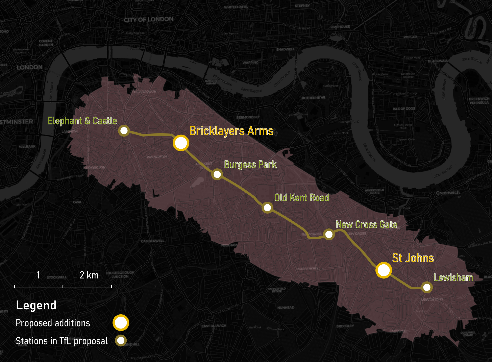

## Bakerloo Line Extension Station Location Analysis
This document summarizes the key findings and methodology of a research project using linear programming to analyze optimal station locations for the Bakerloo Line Extension (BLE) in South London.

### Motivation:

South London residents lack adequate public transit access, limiting job opportunities and commute options. The proposed BLE aims to improve accessibility and revitalize the area. This project aims to inform the BLE's station location planning process by identifying optimal station locations that minimize walking time to stations.

### Methodology:

Two linear programming models were used:

- _Location Set Covering Problem (Problem 1):_ Minimizes the number of stations needed to cover all demand within a set walking time (benchmark: 10 minutes).
- _Adapted P-Median Problem (Problem 2):_ Minimizes the total walking time to stations.

### Results:

- Problem 1 has no feasible solutions with a 10-minute walking time benchmark.
- Problem 2 finds optimal solutions for all station numbers between 3 and 31. An optimal solution with 586 seconds (~10 minutes) average walking time is reached when building _6 new stations_ (excluding Elephant & Castle).

### Recommendations:

Build 6 new stations along the BLE, two more than TfL's current proposal. Consider using the model's insights to inform further studies incorporating:

- Transit usage propensity and future demand.
- Local political considerations.
- Engineering feasibility of station locations.
- Different routing services for walking time calculations.